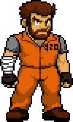
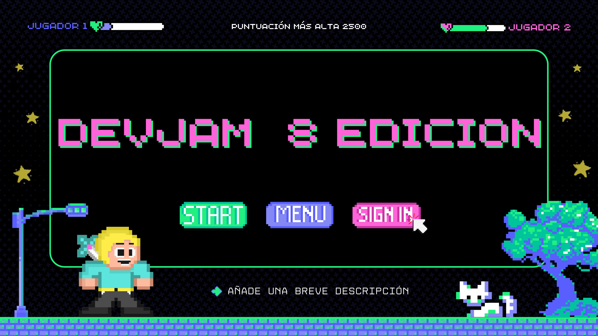

# Dysaster Remake

¡Prepara tus mejores decisiones mientras haces todo por salir con vida!

<!--  -->

## 📝 Contenidos

- [¿Qué es Dysaster?](#about)
- [Trama del videojuego](#plot)
- [Categorías](#categorias)
- [Limitaciones](#limitations)
- [Sobre el desarrollo del videojuego](#getting_started)
- [Configurando la versión de desarrollo](#dev)
- [Jugar la versión oficial](#usage)
- [Tecnologías](#tech_stack)
- [Banda sonora](#soundtrack)
- [Autores](#authors)
- [Agradecimientos](#acknowledgments)

## Dysaster Remake  

Dysaster es una novela visual (juego de decisiones) estilo survival/terror, el cual se ambienta en un mundo azotado por una infección zombie.

## 💡 Sobre el remake

La principal característica de este remake es la migración del motor **RenPy** a **Unity**, un motor mejor consolidado para agregar mini-juegos más complejos, dándonos además la opción de incluir un mini-juego en 3D.

Además de eso el remake nos brinda: 

- Mejoras en las visuales y las animaciones al utilizar renderizado 2D y 3D de Unity.
- Juego más interactivo gracias a diversos recursos disponibles en Unity.
- Mejoras en el audio y los sonidos del juego.
- y mucho más.

## :detective: Trama  

Un peligroso criminal huye de una prisión de máxima seguridad, a medida que la trama avanza se irán sumando más personajes a la historia, juntos deberán sortear distintas dificultades en una odisea mientras tratan de sobrevivir.

## :shamrock: Participación en la _DevJam_

    

El juego participa nuevamente, ahora como remake en la octava _DevJam_ organizada por el CITT, dónde estudiantes de diversas carreras desarrollaran videojuegos.

## 🏁 Sobre nuestro team

Conformamos un equipo de 4 integrantes, y decidimos inscribirnos en la categoría de *trayectoria*, migrando el motor desde RenPy a Unity con Ink, creando el remake de nuestro famoso juego __Dysaster__.

## 🧐 Categorías 

La DevJam fue organizada por el CTTT, en las bases del concurso se especifica que existen tres caterogías:
- Trayectoria: Juegos ya creados en instancias anteriores como el track de videojuegos o proyectos académicos.
- Juego con enfoque medioambiental y cultural: Videojuegos que busquen la conciencia ambiental, respeto por la biodiversidad, el uso eficiente de recursos y la valorización cultural.
- Diseño de personajes: Se busca premiar la creación de personajes originales con una historia sólida, con profundidad, contexto y coherencia.

## ⛓️ Limitaciones 

La migración del juego tomó bastante tiempo y el enfoque principal fueron los mini-juegos que se fueron incorporando, por tanto la trama no cambió tanto como lo era originalmente.

## 🏁 Desarrollo del juego 

El juego usa el motor [Unity](https://unity.com/) para su desarrollo (basado en [C#](https://dotnet.microsoft.com/languages/csharp)), y compilado para su posterior uso. Sin embargo, la versión oficial **No necesita recompilarlo**, sólo descargar y jugar.

- Ver [versión de oficial](#usage)
- Ver [versión de desarrollo](#dev)

### Requisitos Previos

Para la versión oficial **sólo será bajar y jugar**. (en proceso)

Para la versión de desarrollo se necesita el motor de creación de videojuegos **[Unity](https://unity.com/)**.

### Configurando la versión de desarrollo  

- Ya instalado [Unity](https://unity.com/) se procede a **descargar/clonar este repositorio**.
- En caso de descargar comprimido, **se debe extraer dentro de una carpeta**.
- Abrir la carpeta usando Unity, y buscar en la barra superior el botón de play. (un triángulo blanco)
- y listo, ¡A jugar!

## 🎈 Jugar la versión oficial 

### ¡La versión oficial podrá descargarse pronto!

¡Pronto!

## ⛏️ Tecnologías usadas 

- [Unity](https://unity.com/) - Motor para crear videojuegos.
- [Ink](https://www.inklestudios.com/ink/) - Lenguaje de narración de guiones para juegos.
- [Ink-Fungus Gateway](https://maurovanetti.itch.io/ifg) - Herramienta para crear juegos narrativos.

## :musical_score: Banda Sonora  

El Soundtrack del juego estará disponible en formato mp3
- :microphone:	**main-menu-voice.mp3** (¡Pronto!)
- :musical_note: **bg-renovated-theme.mp3** (¡Pronto!)

## ✍️ Autores 

- :man_student: [@Marfullsen](https://github.com/Marfullsen) - Jefe de proyecto, migración de diálogos, Pitch final.
- :man_student: [@rowils](https://github.com/rowils) - Dibujos, bocetos, animaciones, generar ideas.
- :man_student: [@Lilith116](https://github.com/Lilith116) - Programación, investigador de tecnologías, encargado de los minijuegos.
- :man_student: [@jorgsalazarp](https://github.com/jorgsalazarp) - Programación, prototipado, QA.

## 🎉 Agradecimientos, referencias y menciones 

- Agradecimientos al profesor del taller de videojuegos de San Joaquin.
  - :man_teacher: Erwin Aguilera Segura
- :globe_with_meridians: [Juego Original](https://github.com/Marfullsen/dysaster-the-game) ganador de la DevJam 2021.
- :globe_with_meridians: [Freepik](https://www.freepik.com/free-photos-vectors/)
- :globe_with_meridians: [Documentación oficial de Unity](https://docs.unity.com/)
- :globe_with_meridians: Asset de extensión [Ink Integration for Unity](https://assetstore.unity.com/packages/tools/integration/ink-integration-for-unity-60055)